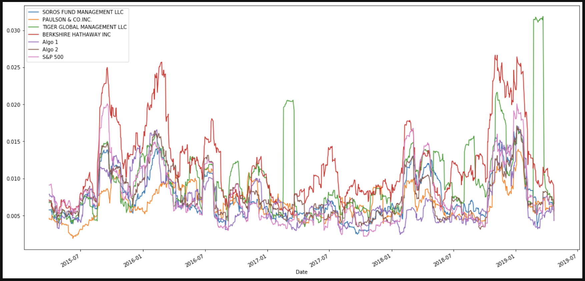

# A Whale Off the Port(folio) Assignment


*This repo contains the Unit 4 Pandas homework assignment; A Whale Off the Port(folio) for UofT's SCS FinTech bootcamp program.*

## Table of Contents

- [Project Description](#Project-Description)
- [Installation Requirements](#Installation-Requirements)
- [File Contents](#File-Contents)

## Project Description

---

The following assignment conducts a financial analysis of portfolios containing various equities representing those of "whale" investors and firms' algorithmic portfolios to visualize and compare performance to that of the S&P 500 market. An assortment of Python and Pandas technqiues are used to perform a quantitative analysis of risk, returns, volatitlity, and sharpe ratios to determine which portfolio returns optimal performance. 

Additionally, the same metrics are applied to develop and analyze a custom portfolio. The purpose of the personal portfolio is to compare its results to those in part one of the assignment and assess the equities returns.



### Assignment File Location:

*The assignment file, "whale_analysis.ipynb" is located in:*
 
    Parent Folder -> Instructions -> Starter Code

## Installation Requirements

---

```
pip install pandas
pip install numpy
pip install matplotlib
```

## File Contents 

---

* ReadMe
* Images Directory
* Instructions Directory
* Starter Code Directory
* whale_analysis.ipynb
* Resources Directory
* My Portfolio Resources Directory

    

